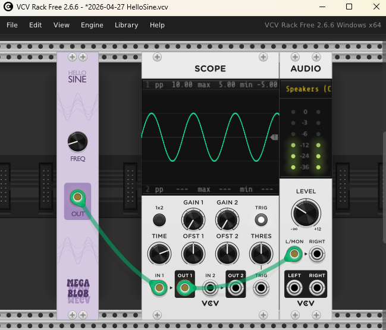

Modules for VCV Rack 2, a virtual Eurorack modular synthesizer platform
* [https://vcvrack.com/](https://vcvrack.com/)
* [https://github.com/VCVRack/Rack](https://github.com/VCVRack/Rack)

# HelloSine
My first VCV Rack 2 module! It's a single sine wave generator (20Hz - 20kHz) with a frequency control knob.

